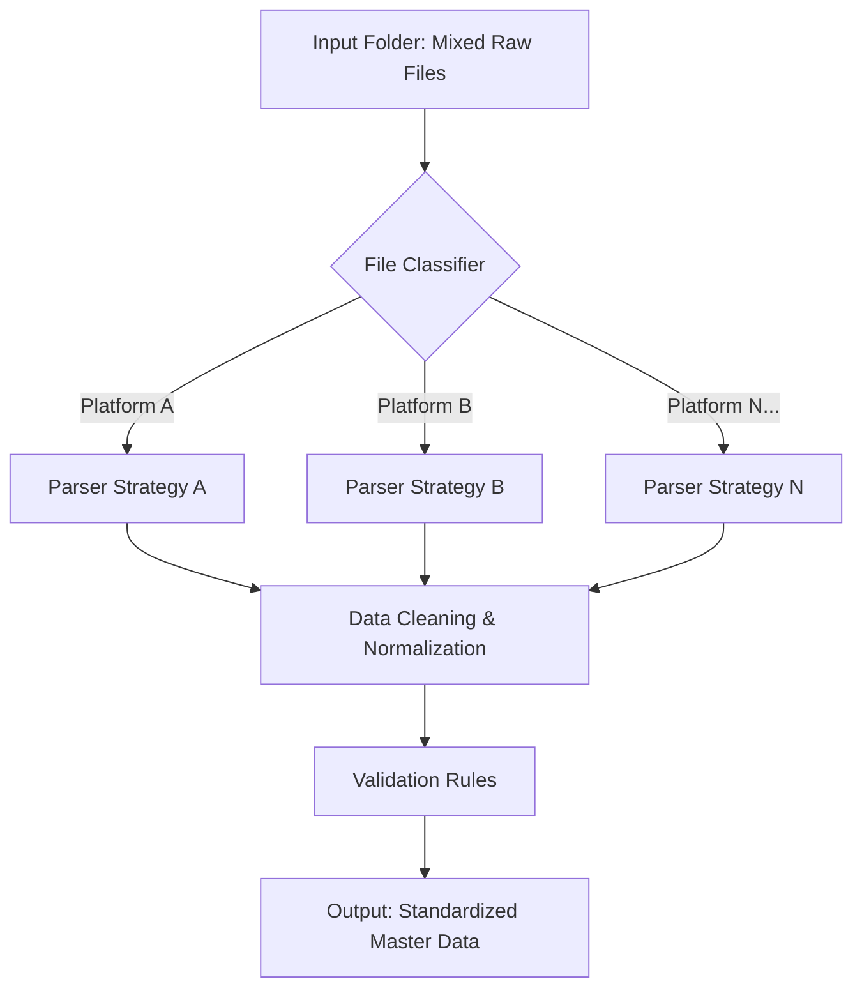

# 📊 Fund Data ETL Pipeline (基金单数据提取自动化)


## Project Overview (项目简介)

**Fund Data ETL Pipeline** is an automated data processing solution designed to tackle the fragmentation of **daily fund transaction statements** for **investment portfolios** that traditionally require manual entry.
> **项目背景：** 本项目旨在解决资管产品（Investment Portfolios）每日需手工录入繁杂基金单据（Transaction Statements）的痛点。

In the asset management industry, fund transaction data originates from diverse **distribution platforms** (Sales Agencies) with inconsistent formats. This tool serves as a **Unified Data Adaptor**, capable of automatically identifying, extracting, and standardizing data from **20+ distribution platforms** (Banks, Third-party agencies) covering **5 core transaction types** (Subscription, Redemption, Dividend, etc.).
> **核心痛点：** 在资管行业，交易数据来自各类**代销机构/平台**，格式千差万别。本工具作为一个**统一数据适配器**，能够自动识别、提取并标准化来自 **20+家代销机构** 的数据，覆盖 **5种核心业务类型**（申购、赎回、分红等）。

**Impact:** This tool transforms a **manual data entry process** that typically takes hours into a sub-minute automated task, ensuring 100% data accuracy for Hundsun valuation systems.
> **项目成效：** 将原本耗时数小时的**手工录入单据**流程转化为分钟级的自动化任务，并确保恒生估值系统（Hundsun）入库数据的100%准确率。

## Key Features (核心功能)

* **Multi-Source Compatibility:** Implemented a scalable strategy pattern to handle distinctive formats from 20+ financial institutions (e.g., ICBC, CMB, Alipay, Tiantian Fund, etc.).
* **Intelligent Classification:** Automatically detects document types based on file signatures and naming conventions (e.g., Confirmation Notes, Dividend Statements, Settlement Sheets).
* **Robust Data Cleaning:** Uses Advanced RegEx and Pandas to normalize "dirty data" (merged cells, irregular headers, non-standard date formats).
* **Batch Processing:** Capable of processing hundreds of files locally in seconds, outputting a unified CSV/Excel standard ready for SQL ingestion.

## Tech Stack (技术栈)

* **Core Logic:** Python 3.x
* **Data Manipulation:** Pandas, NumPy
* **File Parsing:** `pdfplumber` (PDF), `openpyxl`/`xlrd` (Excel), `os`/`shutil` (File I/O)
* **Pattern Matching:** Regular Expressions (Re)

## Workflow Architecture (工作流)



## Project Structure (项目结构)

```text
Fund-Data-ETL-Pipeline/
├── src/
│   ├── extractors/       # Specific logic for different banks/platforms
│   ├── processors/       # Data cleaning and normalization modules
│   └── utils/            # Helper functions (File IO, Logger)
├── data/
│   ├── input/            # Place raw statements here (GitIgnored)
│   └── output/           # Result files generated here
├── main.py               # Entry point of the application
├── requirements.txt      # Dependencies
└── README.md             # Project documentation
```
## Quick Start (如何运行)

**Step 1: Clone the repository**
```bash
git clone [https://github.com/chenshuting-nancy/Fund-Data-ETL-Pipeline.git](https://github.com/chenshuting-nancy/Fund-Data-ETL-Pipeline.git)
```
**Step 2.Install dependencies**
```bash
pip install -r requirements.txt
```
**Step 3.Run the pipeline**
Place your raw Excel/PDF files in the data/input folder and run:
```bash
python main.py
```

## Disclaimer (免责声明)
This project is a portfolio demonstration. All sensitive business logic, proprietary algorithms, and real financial data have been removed or obfuscated to comply with data privacy regulations. The uploaded code represents the structural framework and general processing logic.

---
### Contact & Availability
* **Author:** Nancy Chen
* **Email:** nancychenshuting@hotmail.com
* **Status:** *Open to freelance opportunities in Financial Automation & Python Development.*
